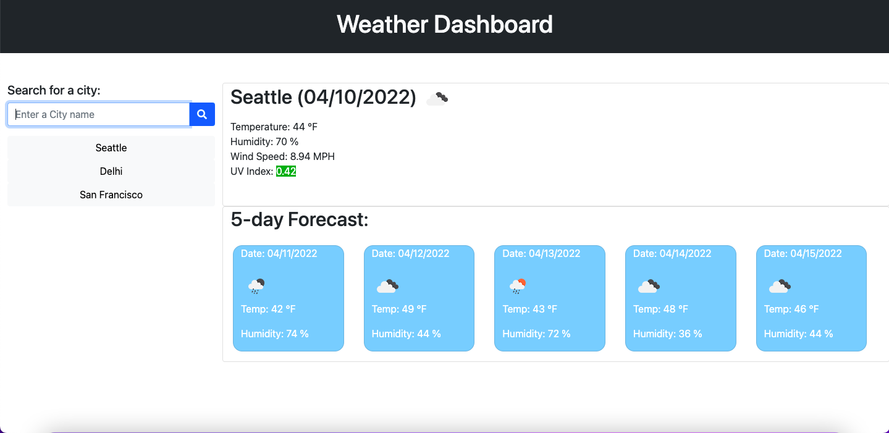

# Weather-Dashboard
It is a weather dashboard that takes input from user to search for weather outlook for multiple cities so travelers can plan a trip accordingly.It uses the [OpenWeather API](https://openweathermap.org/api) to retrieve weather data for different cities and Uses localStorage to store any cities that have been searched and allows user to call them up quickly.

## Technology used
- HTML
- CSS
- Javascript
- Bootstrap
- jQuery
- Moment.js
- OpenWeather API

## Screenshots

## Deployment URL
https://17keerti.github.io/Weather-Dashboard/